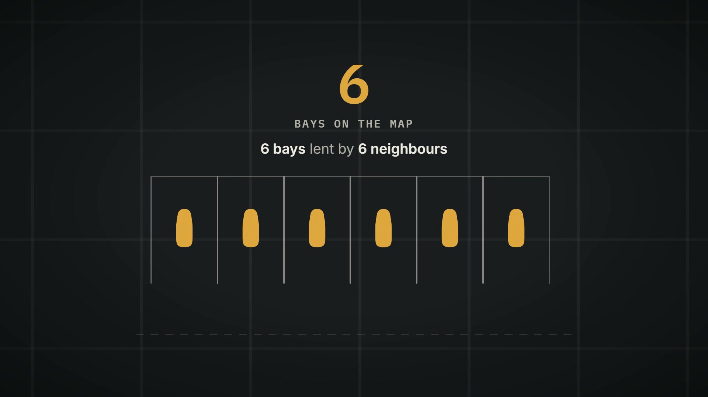

# SwapSpot

A UK parking-bay swap app. List, browse, and swap access to parking bays with
other members, with a credits economy, demand-based pricing, and a Swap Plus
tier (currently locked, in beta).

**Live demo:** https://dankelechii.github.io/SwapSpot/

## See it work

[Watch the 20 second demo](https://dankelechii.github.io/SwapSpot/media/demo.mp4)
(has sound). An empty map fills as neighbours lend their bays, a real listing
gets requested for 5 credits, and the credits come straight back when you lend
yours out. That loop is the whole product.

## How it works

The front end is still one self-contained file- `index.html`, no build step,
no framework- but it is no longer a single-player simulation. It talks to a
real Postgres backend on a dedicated Supabase project:

- **Real accounts.** Sign-up and sign-in go through Supabase Auth
  (`signUp` / `signInWithPassword`), and your session is restored on return
  visits, so your data follows you to another device.
- **Real listings.** The home feed comes from the `browse_listings()` RPC, not
  a hardcoded array. Six seeded bays are owned by a demo account so the feed
  is never empty for a new tester.
- **Real swaps.** `request_swap`, `approve_swap_request`, and
  `decline_swap_request` are `security definer` RPCs. An approved swap moves
  credits from the requester's wallet to the listing owner's wallet.
- **Credits are a ledger.** `credit_ledger` records every grant and charge;
  the balance shown in the app is a cached total the RPCs keep in sync.
- **The server decides what things cost.** Swap cost and "hot" status are
  computed at request time from the real count of existing requests on a
  listing, not trusted from the client. A client with a valid session token
  still can't grant itself credits or approve its own request- Postgres
  enforces that via RLS and the RPCs, not app code.

The Supabase URL and publishable key are hardcoded in `index.html`. That's by
design- they're safe to expose client-side, which is what RLS and the RPCs
are there for.

The schema lives in [`supabase/schema.sql`](supabase/schema.sql), and
[`supabase/README.md`](supabase/README.md) explains the design decisions
behind it in detail.

### Local demo fallback

If the Supabase client can't initialise or the feed request fails, the app
falls back to a set of local demo listings and browser local storage, so it
still runs end-to-end offline (open the file from disk and it works). Local
storage is also still used to cache some UI state between visits. Being in
this mode is a fallback, not the normal path- the backend is the source of
truth.

## Running it

No build step. Either:

- Open `index.html` directly in a browser, or
- Serve it locally: `npx serve .` (or any static file server) and visit
  http://localhost:3000, or
- Use the GitHub Pages deploy at https://dankelechii.github.io/SwapSpot/
  (Settings → Pages → deploy from the `main` branch, root folder)

## What's real, and what isn't yet

Real and working:

- Accounts, sessions, profiles
- Browsing live listings
- Sending, approving, and declining swap requests
- The credits ledger and balances
- Creating a listing (verified owners only- see below)
- Uploading a bay photo to Storage

Deliberately not done yet:

- **Payments.** The `plus_subscriptions` table models the data, but nothing
  takes an actual £1.99. Swap Plus stays locked- `PLUS_ENABLED` is `false` in
  the code- and the instant-book path it would unlock never triggers today.
- **Verification is approved by hand.** You can upload a bay photo and see
  "Pending review", but nothing in the schema lets a client mark itself
  verified. Dan flips `profiles.verification_status` in the Supabase Table
  Editor after looking at the upload. **Only verified owners can list a bay**,
  so a tester who wants to test *listing* (rather than just browsing and
  requesting) needs approving first. This was a deliberate call over building
  a fake self-approval flow.
- **Real geosearch.** There's no user geolocation yet. Distances are computed
  client-side with the Haversine formula against a fixed reference point
  (Shoreditch High St), and the server's `is_near` check is stubbed to `false`.
- **Listing expiry.** The `expired` status exists as a value but no scheduled
  job flips it yet.
- **Terms & Conditions** are a legal draft pending solicitor review, not final.

## We'd like people to stress test this

It's already been through several automated passes- injection/XSS attempts,
rapid-fire clicking and double-submit race conditions, boundary values
(negative credits, absurd offer counts), corrupted saved-session data, and
viewport sizes from a 280px phone to a 2560px desktop. All clean at time of
writing (one real XSS bug was found this way and fixed).

What's genuinely more useful coming from real people than from scripted tests:

- **Real devices and browsers**- Safari on an actual iPhone, older Android
  Chrome, Firefox. The automated passes only ran headless Chromium.
- **Touch gestures**- swipes, pinch-zoom, long-press, double-tap-to-zoom on
  the map screen.
- **Screen readers / accessibility**- VoiceOver, TalkBack, keyboard-only
  navigation through the whole onboarding flow.
- **Weird real-world input**- pasting text with emoji, RTL text, or
  copy-pasted formatting into the name/email fields.
- **Slow or flaky networks**- Google Fonts and the Supabase JS client both
  load from a CDN. See how the app behaves if either is slow or blocked, and
  whether the fallback to local demo mode is graceful.
- **Two real accounts at once**- now that swaps involve two actual people,
  try requesting and approving between two devices and check the credits move
  correctly on both sides.
- **Multiple tabs open at once**- sign in on one tab, act on both, and see
  whether the cached state and the server agree afterwards.
- **The credits/surge economy**- try to find a sequence of actions that
  leaves a credit balance in a state that doesn't add up.

## Reporting what you find

Open an issue with steps to reproduce, what you expected, and what actually
happened. Screenshots and screen recordings help a lot for anything visual or
timing-related.
